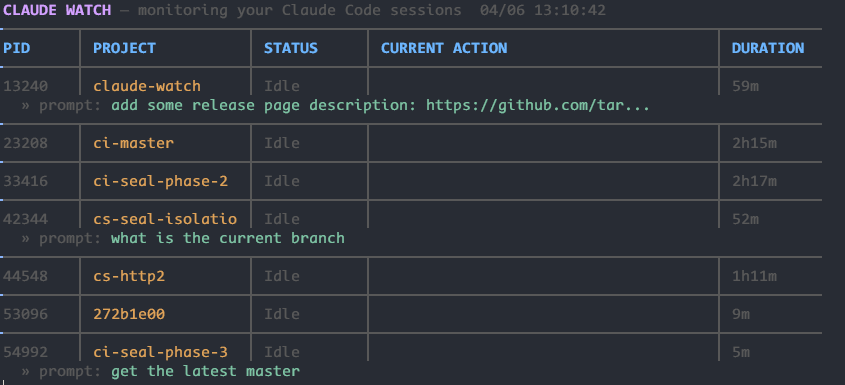

# claude-watch

A zero-setup CLI dashboard for monitoring Claude Code agents in real time.

Run `claude-watch` and instantly see what all your running Claude Code sessions are doing -- which project, current action, and how long they've been running. Designed to live in a tmux pane as your agent task manager.



## How it works

claude-watch discovers running Claude processes from the OS process list, matches each to its most recent session transcript in `~/.claude/projects/`, and renders a continuously-updating dashboard.

No hooks to configure, no agents to register, no setup. It discovers running Claude processes and reads what's already on disk.

## Prerequisites

Install Go 1.21 or later:

```bash
# macOS
brew install go

# Windows
winget install GoLang.Go

# Linux (Debian/Ubuntu)
sudo apt install golang-go

# Linux (Fedora)
sudo dnf install golang
```

## Installation

```bash
go install github.com/tarikguney/claude-watch@latest
```

## Usage

```bash
# Just run it
claude-watch

# Custom refresh interval
claude-watch --refresh 1s

# Custom Claude directory
claude-watch --claude-dir /path/to/.claude

# Compact mode for narrow tmux panes
claude-watch --compact
```

## Status indicators

| Status | Meaning |
|---|---|
| **Responding** | Claude is actively working -- thinking, calling tools, or generating a response |
| **Idle** | Process is running but Claude is waiting for user input |
| **Done** | Session completed |
| **Error** | Last tool call returned an error |

## Platform support

Works on Windows, macOS, and Linux. Process discovery uses:
- **Windows**: PowerShell (`Get-CimInstance Win32_Process`)
- **macOS/Linux**: `ps` with command-line flag parsing

## License

MIT
