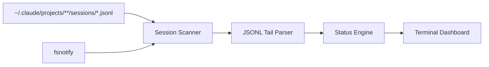

# claude-watch Spec

## Architecture

Zero-setup CLI tool. Monitors Claude Code session transcripts on disk. No hooks, no config, no agent registration. Just run `claude-watch` and it finds everything.



## Data Source

Claude Code writes append-only JSONL transcripts to:
```
~/.claude/projects/<url-encoded-project-path>/sessions/<session-uuid>.jsonl
```

Each line is a JSON record with this envelope:
```json
{
  "type": "assistant|user|system|summary|result|file-history-snapshot",
  "uuid": "...",
  "parentUuid": "...",
  "timestamp": "2025-02-20T09:14:32.441Z",
  "sessionId": "abc123",
  "cwd": "/home/user/myapp",
  "message": { ... }
}
```

### What we extract per session

| Need | Source |
|---|---|
| **Project name** | Decode from directory path: `-Users-tarik-myapp` -> `myapp` |
| **Original task** | First `user` record's `message.content` (string), truncated |
| **Current action** | Last `assistant` record's `message.content[]` -> find last `tool_use` block -> `name` + `input` |
| **Status** | Derived (see Status Engine below) |
| **Duration** | First record `timestamp` vs now |
| **Model** | `message.model` on `assistant` records |

### Tool use -> one-liner mapping

From the last `tool_use` content block in the last `assistant` record:

| tool_use.name | tool_use.input field | Display |
|---|---|---|
| `Read` | `file_path` | "Reading src/auth.ts" |
| `Edit` | `file_path` | "Editing src/auth.ts" |
| `Write` | `file_path` | "Writing src/auth.ts" |
| `Bash` | `command` (truncated) | "Running npm test" |
| `Grep` | `pattern` | "Searching for validateToken" |
| `Glob` | `pattern` | "Finding *.test.ts" |
| `Task` | `description` | "Subagent: explore auth flow" |
| `WebSearch` | `query` | "Searching: JWT best practices" |
| `WebFetch` | `url` | "Fetching docs.example.com" |

### Status derivation

| Condition | Status |
|---|---|
| Last record is `result` type | **Done** |
| Last record is `assistant` with `tool_use` and recent timestamp (<2min) | **Active** |
| Last record is `assistant` with `text` only (no tool_use) and recent | **Responding** |
| Last record is `user` type (waiting for model) | **Thinking** |
| Last record timestamp >5min old, no `result` | **Idle** |
| `tool_result` with `is_error: true` as last meaningful event | **Error** |

## Reading strategy

We do NOT parse entire transcripts. For each JSONL file:

1. **On first discovery**: seek to end, read backwards ~16KB to get recent records. Also read the first ~4KB to find the first `user` message (original task).
2. **On file change** (fsnotify): read only the new bytes appended since last read (track file offset per session).
3. **Cache**: store per-session: original task, last status, last action, session start time. Only update on file change.

## Technology: Go

- Single binary, no runtime dependencies
- `fsnotify` for file watching
- `lipgloss` (from charmbracelet) for terminal styling
- Standard `encoding/json` for JSONL parsing
- `flag` or `cobra` for CLI

## File Structure

```
claude-watch/
├── main.go
├── internal/
│   ├── parser/
│   │   └── jsonl.go         # JSONL tail reading + record parsing
│   ├── session/
│   │   ├── scanner.go       # Discover and enumerate session files
│   │   ├── watcher.go       # fsnotify-based file change detection
│   │   └── state.go         # Per-session state: task, action, status, timing
│   └── ui/
│       └── dashboard.go     # Terminal rendering
├── go.mod
├── go.sum
└── README.md
```

## Dashboard Output

```
CLAUDE WATCH                                           04/05 14:23:45
─────────────────────────────────────────────────────────────────────
PROJECT     STATUS   TASK                        CURRENT ACTION                DUR
myapp       Active   Add auth to API endpoints   Editing src/middleware.ts      12m
webapp      Active   Fix login page CSS          Running npm test              05m
backend     Idle     Refactor database layer     Last: Wrote db/schema.ts      18m
cli-tool    Done     Add --verbose flag          Completed                     08m
```

## Color Scheme

Using `lipgloss` (Charmbracelet) for terminal styling. No animations or spinners -- just static colors that update in place.

| Element | Color | Rationale |
|---|---|---|
| **Active** status | Green | Clearly working, positive |
| **Responding** status | Cyan | Distinct from Active, still progressing |
| **Thinking** status | Yellow | Processing, not yet producing output |
| **Idle** status | Dim gray | Faded, not doing anything |
| **Done** status | Blue | Calm, completed |
| **Error** status | Red | Universal error color |
| Header / title | Bold white | Clean emphasis |
| Project name | Bold | Stand out as the row identifier |
| Current action | Normal white | Main content, no distraction |
| Duration | Dim | Secondary info, doesn't compete |
| Separator line | Dim gray | Structural, stays out of the way |

## Usage

```bash
# Just run it -- discovers everything automatically
claude-watch

# Custom refresh interval
claude-watch --refresh 1s

# Custom Claude directory (non-standard install)
claude-watch --claude-dir /path/to/.claude

# Compact mode for narrow tmux panes
claude-watch --compact
```
